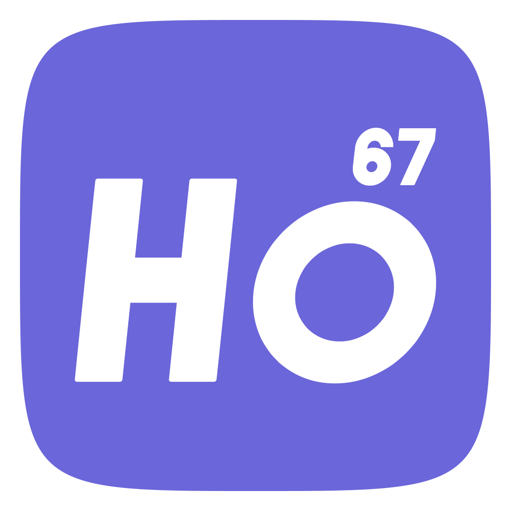
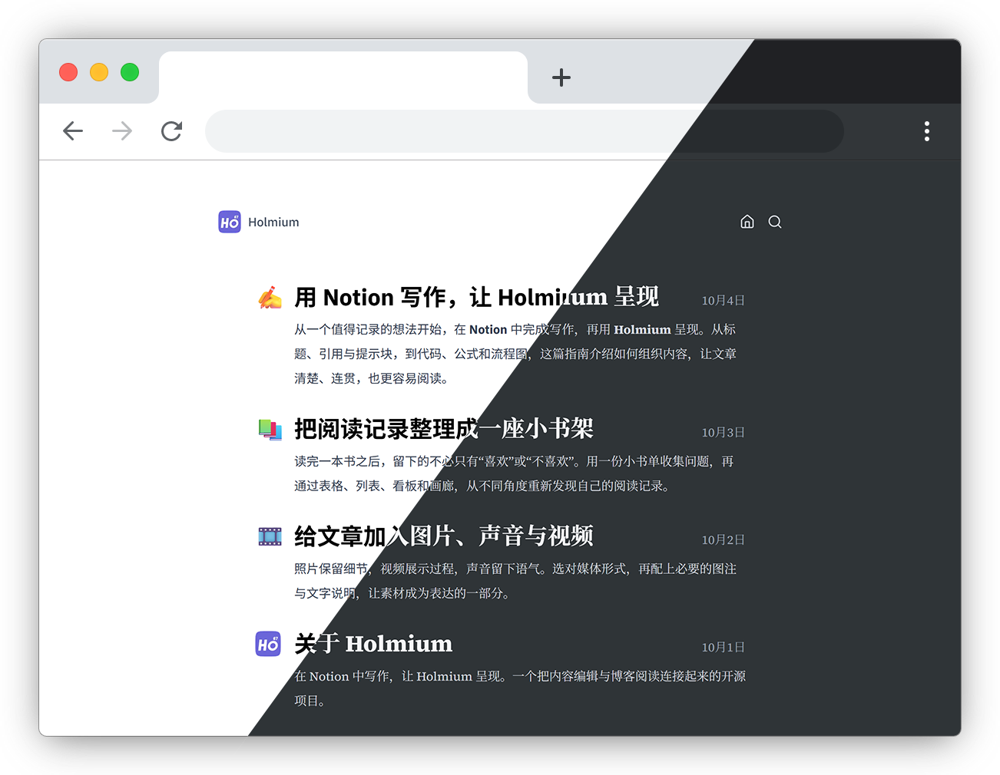

<p align="center">
  
</p>

<h1 align="center">Holmium</h1>

<p align="center">
  在 Notion 中写作，让 Holmium 呈现。
</p>

<p align="center">
  
  
  
  
</p>

<p align="center">
  <a href="https://holmium.vercel.app">示例站</a> ·
  <a href="https://hodpel.notion.site/313167c39c4080bf9675de4a9586f825">复制 Notion 模板</a> ·
  <a href="#功能概览">功能</a> ·
  <a href="#快速开始">快速开始</a> ·
  <a href="#notion-配置">Notion 配置</a> ·
  <a href="#部署">部署</a> ·
  <a href="#参与贡献">参与贡献</a>
</p>

---

Holmium 是一个以 Notion 为内容后台的开源博客系统。你可以直接复制现成的 Notion 模板，在熟悉的编辑器里写作，再部署属于自己的博客。

[示例站](https://holmium.vercel.app)用于查看阅读效果；[Notion 模板](https://hodpel.notion.site/313167c39c4080bf9675de4a9586f825)用于复制到自己的工作区。模板包含博客数据库、写作指南、阅读书架、媒体示范和 About 内容，可以保留作参考，也可以替换成自己的文章。

Holmium 基于 Next.js App Router、`notion-client` 与 `react-notion-x` 构建。Notion 负责内容编辑，Holmium 负责文章索引、页面路由、搜索、标签、分页、主题、分享卡片、媒体资源和评论展示。

项目直接使用 Notion 的 RecordMap 数据结构，不依赖 Notion 官方 API。

## 界面预览



截图展示两种主题与字体组合；主题和字体可以分别配置，不要求固定搭配。

## 功能概览

- 使用 Notion 数据库管理文章与独立页面
- 支持文章列表、标签、分页、站内搜索与 RSS
- 支持 Notion 富文本、公式、Mermaid、媒体与数据库视图
- 支持 Light、Dark 与跟随系统的显示模式
- 支持响应式布局、分享卡片与文章封面
- 支持 Giscus 和 Artalk 评论
- 使用 ISR 缓存，并为上传媒体提供稳定资源入口

## 项目状态

Holmium 的核心博客功能已经可用，项目仍在持续完善。首个稳定版本发布前，配置接口可能调整，不承诺向后兼容。

项目使用了 Notion 的非公开接口。Notion 上游发生变化时，数据读取能力可能需要同步适配。

## 官方地址与站点标识

示例站地址为 <https://holmium.vercel.app>。它展示模板内容的博客效果，不是你的内容编辑入口。自行部署时应在 `blog.config.ts` 中替换站点地址、作者、简介、导航和 SEO 配置。

仓库提供 Holmium 的默认 Header Logo 与 favicon。派生站点可以分别替换 `public/header-logo.png` 和 `public/favicon.png`，并在 `blog.config.ts` 的 `icons` 配置中指定其他路径或独立的深色模式资源。

## 技术栈

- Next.js 16 / React 19 / App Router
- Tailwind CSS 4
- `notion-client` / `react-notion-x`
- Giscus / Artalk 评论
- TypeScript / pnpm

## 环境要求

- Node.js 24.x（`.node-version` 固定主版本）
- pnpm 11.22.0

## 快速开始

### 1. 复制 Notion 模板

打开 [Holmium Notion 模板](https://hodpel.notion.site/313167c39c4080bf9675de4a9586f825)，登录 Notion，点击页面右上角的 **Duplicate / 复制**，选择自己的工作区。

复制后，在自己的工作区打开博客根页面或文章数据库。后续编辑和配置都使用这份副本，不要直接填写上方原模板的页面 ID。

将自己的博客根页面发布到网页，并确认文章和正文中的数据库、媒体等内容也可以公开访问。只开启允许复制并不等于你自己的副本已经公开；未公开时需要额外配置访问令牌。

### 2. 准备项目与环境变量

Fork 或下载本仓库，在项目目录安装依赖：

```bash
pnpm install
```

将 `.env.example` 复制为 `.env.local`，至少填写自己的 `NOTION_PAGE_ID`。页面 ID 的获取方式见下方 [Notion 配置](#notion-配置)。公开模板副本通常不需要填写 `NOTION_ACCESS_TOKEN`。

在 `blog.config.ts` 中修改 `title`、`author`、`description` 和 `siteUrl`。部署后 `siteUrl` 应指向你自己的域名，而不是 Holmium 示例站。

### 3. 本地预览

启动开发服务器：

```bash
pnpm dev
```

默认地址为 <http://localhost:3000>。Next.js 参数可以直接附加，不需要额外的 `--`：

```bash
pnpm dev --port 3050
```

预览确认后，可以在自己的 Notion 副本中替换示范文章。建议保留数据库字段结构，将暂不发布的记录设为 `Draft`。

### 4. 构建与部署

生产构建与本地启动：

```bash
pnpm build
pnpm start
```

也可以直接将自己的仓库导入 Vercel，填写相同的环境变量。完整步骤见 [部署](#部署)。

## Notion 配置

在项目根目录将 `.env.example` 复制为 `.env.local`。公开页面的最小配置如下：

```dotenv
NOTION_PAGE_ID=
NOTION_ACCESS_TOKEN=
NOTION_HOST=www.notion.so
```

| 变量 | 必需 | 说明 |
| --- | --- | --- |
| `NOTION_PAGE_ID` | 必需 | 作为博客索引的 Notion 根页面或数据库 ID |
| `NOTION_ACCESS_TOKEN` | 否 | 访问私有内容时使用；公开内容可以留空 |
| `NOTION_HOST` | 否 | `notion-client` 使用的主机，默认 `www.notion.so`，不要包含协议或末尾斜杠 |

### 获取自己的页面 ID

在 **Duplicate 后的副本** 中，打开博客根页面或文章数据库，通过「复制链接」获取它的 Notion 链接。使用原始 Notion 页面链接，而不是没有 ID 的自定义网站短地址。

例如，链接中的 `0123456789abcdef0123456789abcdef` 就是页面 ID：

```text
https://www.notion.so/Your-Blog-0123456789abcdef0123456789abcdef?v=...
```

将末尾的 32 位页面 ID 填入 `NOTION_PAGE_ID`，不要包含 `?v=...` 等查询参数，也不要填写整条 URL。带连字符的 UUID 形式同样可用。

这里需要的是管理文章列表的数据库页面（模板的博客根页面），不是某一篇文章、包裹数据库的普通说明页面，也不是正文中「阅读书架」这样的演示数据库。若使用自定义 Notion 站点域名，将 `NOTION_HOST` 和 `.env.example` 中的 `NEXT_PUBLIC_NOTION_HOST` 配成相应主机；复制后的副本不需要沿用原模板的域名。

敏感信息只应存放在 `.env.local` 或部署平台的环境变量中。不要将 Notion Token 写入 `blog.config.ts`。

### 数据库字段

Holmium 从 Notion 数据库读取以下字段。字段名称不区分大小写，但字段类型和值需要符合约定。

复制模板后，这些字段已经存在，不必重新创建。写自己的文章时保留字段名称、类型和约定值；下表用于理解模板或手动建库。

| 字段 | Notion 类型 | 必需 | 说明 |
| --- | --- | --- | --- |
| `title` | Title | 是 | 文章或页面标题 |
| `slug` | Text | 是 | URL 路径片段；必须唯一且不能包含 `% / \\ ? #` 等路由字符 |
| `date` | Date | 是 | 发布时间；未来日期不会公开 |
| `status` | Select | 是 | `Published` 或 `Draft` |
| `type` | Select | 是 | `Post` 或 `Page` |
| `summary` | Text | 否 | 首页摘要和基础 Metadata 描述 |
| `tags` | Multi-select | 否 | Post 的标签；Page 不进入标签聚合 |

`Post` 会进入首页、分页、搜索和标签聚合。`Page` 只通过 slug 直接访问，不进入这些内容流。

## 内容缓存

使用普通 Next.js 原生 ISR（不启用 Cache Components／PPR）：完整文章页面的刷新间隔为 300 秒。已有页面超过间隔后先返回旧内容，同时后台更新；更新成功后，后续访问使用新内容。标题与正文在同一次渲染中读取同一份快照，不再先展示标题等待正文。

这不是定时抓取：没有访问时不会持续请求 Notion。首次生成、缓存被驱逐或达到硬过期时间时仍可能等待上游；开发模式也不等同于生产缓存行为。音视频、PDF 和附件通过稳定资源入口获取签名，不依赖整篇文章的版本参数。

## 博客配置

常用公开配置位于项目根目录的 `blog.config.ts`，包括：

- 博客标题、作者、简介和语言
- 时区、字体、明暗模式和主题颜色
- 每页文章数、排序方式和导航栏行为
- 搜索引擎索引开关
- 评论 Provider

这些配置会被 Server Component 和 Client Component 共同使用，因此只能包含可以公开发送到浏览器的信息。

头部导航由 `blog.config.ts` 的 `navigation` 数组配置，可以调整链接、图标、顺序和显示内容。About 等独立内容使用普通 Notion `Page`，需要入口时直接加入该数组。

较少使用的 SEO/Robots 细节位于 `config/blog.advanced.ts`。Notion Token、根页面 ID 和 Host 由 `config/blog.server.ts` 从环境变量读取，该模块只能在服务端使用。

## Giscus 评论

Holmium 支持 Giscus，并使用稳定的 Notion 页面 ID 映射 GitHub Discussion。修改文章 slug 不会创建新的评论线程。

### 准备仓库

1. 准备一个公开的 GitHub 仓库。
2. 在仓库设置中启用 Discussions。
3. 为仓库安装 [Giscus GitHub App](https://github.com/apps/giscus)。
4. 在 [giscus.app](https://giscus.app/zh-CN) 选择仓库和 Discussion 分类，取得 `repoId` 与 `categoryId`。

### 启用评论

在 `blog.config.ts` 中填写：

```ts
comment: {
    provider: 'giscus',
    giscusConfig: {
        repo: 'owner/repository',
        repoId: '',
        category: '',
        categoryId: '',
    },
    artalkConfig: {
        server: '',
        site: '',
    },
},
```

将 `provider` 设为空字符串可以关闭评论：

```ts
comment: {
    provider: '',
    giscusConfig: {
        repo: '',
        repoId: '',
        category: '',
        categoryId: '',
    },
    artalkConfig: {
        server: '',
        site: '',
    },
},
```

上述标识最终会由 Giscus 客户端发送到浏览器，不应当存放 GitHub Token 或其他凭据。评论区会自动跟随 Holmium 的语言、Light/Dark 模式、背景色和主题强调色；未启用或配置不完整时不会加载 Giscus 客户端。

## Artalk 评论

Holmium 也支持连接独立部署的 Artalk 服务。先确保 Artalk 后台已经创建对应站点，并将本地开发地址与正式博客域名加入可信域名，然后在 `blog.config.ts` 中填写：

```ts
comment: {
    provider: 'artalk',
    giscusConfig: {
        repo: '',
        repoId: '',
        category: '',
        categoryId: '',
    },
    artalkConfig: {
        server: 'https://artalk.example.com',
        site: 'Your Site Name',
    },
},
```

Artalk 使用文章的 slug 作为 `pageKey`，例如 `article-slug`。修改文章标题不会影响评论线程，但修改 slug 后需要在 Artalk 后台迁移页面数据。界面功能开关以 Artalk 后台配置为准；`server` 与 `site` 会发送到浏览器，不能在这里填写管理员密码或其他私密凭据。将 `provider` 改为 `giscus` 可切回 Giscus，设为空字符串则关闭评论。

## 构建与验证

```bash
pnpm check
pnpm build
```

`pnpm check` 依次执行完整 TypeScript 检查和全项目 ESLint；它不执行生产构建，也不会修改依赖。

启动已经完成的生产构建：

```bash
pnpm start
```

测试可以单独运行：

```bash
pnpm test
```

## 部署

Vercel 是当前主要部署目标。[Holmium 示例站](https://holmium.vercel.app)展示阅读效果，部署自己的博客不需要绑定示例站的 Notion 数据。

1. 先复制 [Notion 模板](https://hodpel.notion.site/313167c39c4080bf9675de4a9586f825)，发布自己的副本，并取得根页面或文章数据库 ID。
2. 将自己的 Holmium 仓库导入 Vercel，使用 Next.js 项目设置。
3. 在 Vercel 项目环境变量中填写自己的 `NOTION_PAGE_ID`；私有内容才需要 `NOTION_ACCESS_TOKEN`，自定义 Notion 主机再填写相应 Host。
4. 在 `blog.config.ts` 中设置自己的 `siteUrl`、作者信息和导航，然后部署。正式域名确定后若修改了配置，需要重新部署。
5. 打开部署后的首页和一篇文章，检查图片、数据库与媒体是否可访问。此后文章在自己的 Notion 副本里维护，更新显示遵循上面的缓存说明。

至少配置：

```dotenv
NOTION_PAGE_ID=
```

私有 Notion 内容还需要：

```dotenv
NOTION_ACCESS_TOKEN=
```

标准 Production Build Command 使用：

```text
pnpm build
```

未配置 `NOTION_PAGE_ID` 时，构建或运行会明确失败。

## 配置文件边界

| 文件 | 职责 | 是否可以包含秘密 |
| --- | --- | --- |
| `blog.config.ts` | 常用站点公开配置 | 否 |
| `config/blog.advanced.ts` | 不常修改的 SEO/Robots 细节 | 否 |
| `config/blog.server.ts` | 服务端环境变量入口 | 只读取，不写死 |
| `.env.local` | 本地 Notion Token 等实例配置 | 是；文件已被 Git 忽略 |

提交前请确认 `blog.config.ts` 中只包含愿意公开的站点信息，并检查 `.env.local` 没有被纳入版本控制。

## 参与贡献

问题反馈和代码贡献都欢迎。开始修改前，请阅读 [CONTRIBUTING.md](CONTRIBUTING.md)，了解开发环境、验证命令和提交要求。

发现安全问题或仓库中可能存在的敏感信息时，请不要创建公开 Issue，处理方式见 [SECURITY.md](SECURITY.md)。

## 许可证

Holmium 的源代码使用 [MIT License](LICENSE)。项目包含的第三方字体适用各自的许可证，详见 [app/fonts/LICENSES.md](app/fonts/LICENSES.md)。
